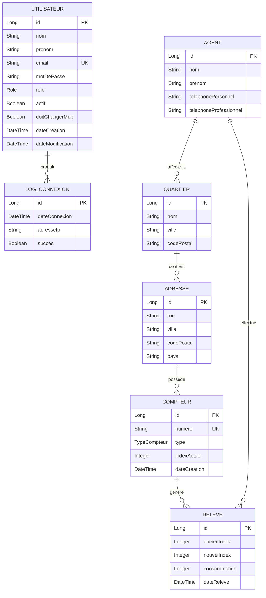

# MCD - Modèle Conceptuel de Données
## SI Relevés - Application Backoffice Web

---

## 1. Diagramme Entité-Relation

---

## 2. Description des Entités

### 2.1 UTILISATEUR
Représente les utilisateurs du backoffice (Superadmin et Utilisateur).

| Attribut | Type | Contraintes | Description |
|----------|------|-------------|-------------|
| id | Long | PK, Auto | Identifiant unique |
| nom | String | NOT NULL | Nom en MAJUSCULES |
| prenom | String | NOT NULL | Prénom en Nom Propre |
| email | String | UK, NOT NULL | Email unique |
| motDePasse | String | NOT NULL | Hash BCrypt |
| role | Enum | NOT NULL | SUPERADMIN, UTILISATEUR |
| actif | Boolean | DEFAULT TRUE | Compte actif |
| doitChangerMdp | Boolean | DEFAULT FALSE | Forcer changement |
| dateCreation | DateTime | Auto | Date création |
| dateModification | DateTime | Auto | Dernière modification |

### 2.2 AGENT
Représente les agents de terrain effectuant les relevés.

| Attribut | Type | Contraintes | Description |
|----------|------|-------------|-------------|
| id | Long | PK, Auto | Identifiant unique |
| nom | String | NOT NULL | Nom de famille |
| prenom | String | NOT NULL | Prénom |
| telephonePersonnel | String | - | N° perso |
| telephoneProfessionnel | String | - | N° pro REE |

### 2.3 QUARTIER
Zones géographiques de la ville de Rabat.

| Attribut | Type | Contraintes | Description |
|----------|------|-------------|-------------|
| id | Long | PK, Auto | Identifiant unique |
| nom | String | NOT NULL, UK | Nom du quartier |
| ville | String | DEFAULT "Rabat" | Ville |
| codePostal | String | - | Code postal |

### 2.4 ADRESSE
Adresses physiques des compteurs.

| Attribut | Type | Contraintes | Description |
|----------|------|-------------|-------------|
| id | Long | PK, Auto | Identifiant unique |
| rue | String | NOT NULL | Adresse complète |
| ville | String | NOT NULL | Ville |
| codePostal | String | - | Code postal |
| pays | String | DEFAULT "Maroc" | Pays |

### 2.5 COMPTEUR
Compteurs d'eau et d'électricité.

| Attribut | Type | Contraintes | Description |
|----------|------|-------------|-------------|
| id | Long | PK, Auto | Identifiant unique |
| numero | String | UK, 9 chiffres | Ex: 000000001 |
| type | Enum | NOT NULL | EAU, ELECTRICITE |
| indexActuel | Integer | DEFAULT 0 | Index courant |
| dateCreation | DateTime | Auto | Date installation |

**Contrainte** : Max 1 compteur par type par adresse.

### 2.6 RELEVE
Relevés de consommation effectués par les agents.

| Attribut | Type | Contraintes | Description |
|----------|------|-------------|-------------|
| id | Long | PK, Auto | Identifiant unique |
| ancienIndex | Integer | NOT NULL | Index précédent |
| nouvelIndex | Integer | NOT NULL | Index relevé |
| consommation | Integer | Calculé | nouvelIndex - ancienIndex |
| dateReleve | DateTime | NOT NULL | Timestamp relevé |

### 2.7 LOG_CONNEXION
Historique des connexions au système.

| Attribut | Type | Contraintes | Description |
|----------|------|-------------|-------------|
| id | Long | PK, Auto | Identifiant unique |
| dateConnexion | DateTime | NOT NULL | Timestamp |
| adresseIp | String | - | IP de connexion |
| succes | Boolean | NOT NULL | Connexion réussie |

---

## 3. Relations

| Relation | Entité 1 | Entité 2 | Cardinalité | Description |
|----------|----------|----------|-------------|-------------|
| Affectation | AGENT | QUARTIER | N:M | Un agent peut être affecté à plusieurs quartiers |
| Localisation | ADRESSE | QUARTIER | N:1 | Une adresse appartient à un quartier |
| Installation | COMPTEUR | ADRESSE | N:1 | Un compteur est installé à une adresse |
| Relevé | RELEVE | COMPTEUR | N:1 | Un relevé concerne un compteur |
| Effectue | RELEVE | AGENT | N:1 | Un relevé est fait par un agent |
| Session | LOG_CONNEXION | UTILISATEUR | N:1 | Une connexion est faite par un utilisateur |

---

## 4. Contraintes d'Intégrité

1. **CI-01** : Un compteur de type X ne peut exister qu'une fois par adresse
2. **CI-02** : Le numéro de compteur doit avoir exactement 9 chiffres
3. **CI-03** : La consommation ne peut pas être négative
4. **CI-04** : Un email utilisateur doit être unique
5. **CI-05** : Le nom utilisateur doit être en MAJUSCULES

---

*Document généré avec assistance IA*
*Date : Décembre 2024*
