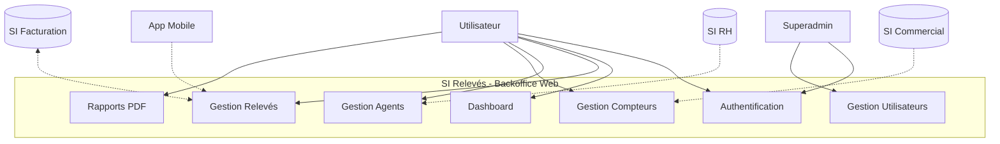
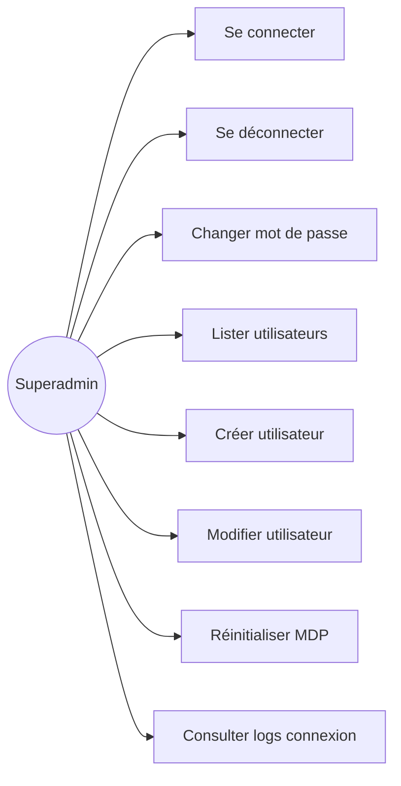
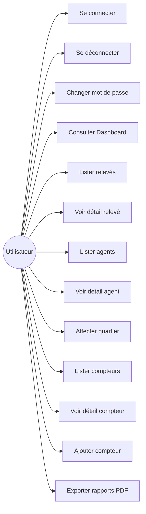

# Diagrammes Use Case
## SI Relevés - Application Backoffice Web

---

## 1. Vue Générale du Système

---

## 2. Use Cases par Acteur

### 2.1 Use Cases - Superadmin

### 2.2 Use Cases - Utilisateur

---

## 3. Use Cases Détaillés

### UC-01: Se Connecter

| Attribut | Valeur |
|----------|--------|
| **Acteur** | Superadmin, Utilisateur |
| **Précondition** | L'utilisateur a un compte valide |
| **Déclencheur** | L'utilisateur accède à la page login |
| **Scénario nominal** | 1. Saisie email + mot de passe 2. Validation des credentials 3. Génération token JWT 4. Redirection dashboard |
| **Scénario alternatif** | Credentials invalides → Message erreur |
| **Postcondition** | Utilisateur connecté, session active |

### UC-02: Consulter Dashboard

| Attribut | Valeur |
|----------|--------|
| **Acteur** | Utilisateur |
| **Précondition** | Utilisateur connecté |
| **Déclencheur** | Accès page /dashboard |
| **Scénario nominal** | 1. Affichage KPIs 2. Graphiques consommation 3. Stats par quartier |
| **Extensions** | Filtrage par période |
| **Postcondition** | Dashboard affiché |

### UC-03: Ajouter Compteur

| Attribut | Valeur |
|----------|--------|
| **Acteur** | Utilisateur |
| **Précondition** | Utilisateur connecté |
| **Déclencheur** | Clic bouton "Ajouter" |
| **Scénario nominal** | 1. Ouverture popup adresses 2. Sélection adresse 3. Choix type (Eau/Elec) 4. Validation 5. Génération ID automatique |
| **Scénario alternatif** | Adresse a déjà ce type → Erreur |
| **Postcondition** | Compteur créé avec index = 0 |

### UC-04: Affecter Agent à Quartier

| Attribut | Valeur |
|----------|--------|
| **Acteur** | Utilisateur |
| **Précondition** | Agent existe, Utilisateur connecté |
| **Déclencheur** | Modification sur page détail agent |
| **Scénario nominal** | 1. Sélection quartier 2. Sauvegarde |
| **Postcondition** | Agent affecté au quartier |

### UC-05: Exporter Rapport PDF

| Attribut | Valeur |
|----------|--------|
| **Acteur** | Utilisateur |
| **Précondition** | Utilisateur connecté |
| **Déclencheur** | Clic bouton export |
| **Scénario nominal** | 1. Sélection type rapport 2. Génération PDF 3. Téléchargement |
| **Postcondition** | Fichier PDF téléchargé |

### UC-06: Créer Utilisateur

| Attribut | Valeur |
|----------|--------|
| **Acteur** | Superadmin |
| **Précondition** | Superadmin connecté |
| **Déclencheur** | Clic bouton "Ajouter" |
| **Scénario nominal** | 1. Saisie nom (MAJUSCULES) 2. Saisie prénom 3. Choix rôle 4. Validation 5. Génération MDP 6. Envoi email |
| **Postcondition** | Utilisateur créé, email envoyé |

### UC-07: Réinitialiser Mot de Passe

| Attribut | Valeur |
|----------|--------|
| **Acteur** | Superadmin |
| **Précondition** | Superadmin connecté, utilisateur existe |
| **Déclencheur** | Clic bouton "Réinitialiser MDP" |
| **Scénario nominal** | 1. Confirmation 2. Génération nouveau MDP 3. Envoi email 4. Flag changement obligatoire |
| **Postcondition** | MDP réinitialisé |

---

## 4. Matrice CRUD

| Entité | Superadmin | Utilisateur |
|--------|:----------:|:-----------:|
| Utilisateur | CRUD | R (self) |
| Compteur | R | CRU |
| Agent | R | RU |
| Relevé | R | R |
| Quartier | R | R |
| LogConnexion | R | - |

**Légende** : C=Create, R=Read, U=Update, D=Delete

---

*Document généré avec assistance IA*
*Date : Décembre 2024*
