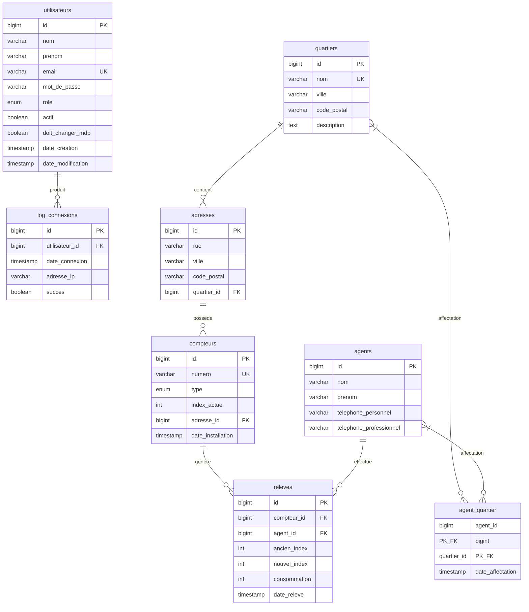

# MLD - Modèle Logique de Données
## SI Relevés - Base de Données MySQL

---

## 1. Schéma de Base de Données

```sql
-- =============================================
-- SI RELEVÉS - SCHÉMA BASE DE DONNÉES
-- Rabat Énergie & Eau (REE)
-- =============================================

-- Table: utilisateurs
CREATE TABLE utilisateurs (
    id BIGINT AUTO_INCREMENT PRIMARY KEY,
    nom VARCHAR(100) NOT NULL,
    prenom VARCHAR(100) NOT NULL,
    email VARCHAR(255) NOT NULL UNIQUE,
    mot_de_passe VARCHAR(255) NOT NULL,
    role ENUM('SUPERADMIN', 'UTILISATEUR') NOT NULL DEFAULT 'UTILISATEUR',
    actif BOOLEAN DEFAULT TRUE,
    doit_changer_mdp BOOLEAN DEFAULT FALSE,
    date_creation TIMESTAMP DEFAULT CURRENT_TIMESTAMP,
    date_modification TIMESTAMP DEFAULT CURRENT_TIMESTAMP ON UPDATE CURRENT_TIMESTAMP,
    
    INDEX idx_email (email),
    INDEX idx_role (role)
);

-- Table: quartiers
CREATE TABLE quartiers (
    id BIGINT AUTO_INCREMENT PRIMARY KEY,
    nom VARCHAR(100) NOT NULL UNIQUE,
    ville VARCHAR(100) DEFAULT 'Rabat',
    code_postal VARCHAR(10),
    description TEXT,
    superficie DECIMAL(10,2),
    population INT,
    latitude DECIMAL(10,8),
    longitude DECIMAL(11,8),
    
    INDEX idx_nom (nom)
);

-- Table: agents
CREATE TABLE agents (
    id BIGINT AUTO_INCREMENT PRIMARY KEY,
    nom VARCHAR(100) NOT NULL,
    prenom VARCHAR(100) NOT NULL,
    telephone_personnel VARCHAR(20),
    telephone_professionnel VARCHAR(20),
    email VARCHAR(255),
    date_creation TIMESTAMP DEFAULT CURRENT_TIMESTAMP,
    
    INDEX idx_nom_prenom (nom, prenom)
);

-- Table: agent_quartier (relation N:M)
CREATE TABLE agent_quartier (
    agent_id BIGINT NOT NULL,
    quartier_id BIGINT NOT NULL,
    date_affectation TIMESTAMP DEFAULT CURRENT_TIMESTAMP,
    
    PRIMARY KEY (agent_id, quartier_id),
    FOREIGN KEY (agent_id) REFERENCES agents(id) ON DELETE CASCADE,
    FOREIGN KEY (quartier_id) REFERENCES quartiers(id) ON DELETE CASCADE
);

-- Table: adresses
CREATE TABLE adresses (
    id BIGINT AUTO_INCREMENT PRIMARY KEY,
    rue VARCHAR(255) NOT NULL,
    ville VARCHAR(100) NOT NULL DEFAULT 'Rabat',
    code_postal VARCHAR(10),
    pays VARCHAR(50) DEFAULT 'Maroc',
    quartier_id BIGINT,
    client_id VARCHAR(50),
    
    FOREIGN KEY (quartier_id) REFERENCES quartiers(id) ON DELETE SET NULL,
    INDEX idx_quartier (quartier_id),
    INDEX idx_client (client_id)
);

-- Table: compteurs
CREATE TABLE compteurs (
    id BIGINT AUTO_INCREMENT PRIMARY KEY,
    numero VARCHAR(9) NOT NULL UNIQUE,
    type ENUM('EAU', 'ELECTRICITE') NOT NULL,
    index_actuel INT DEFAULT 0,
    adresse_id BIGINT NOT NULL,
    statut ENUM('ACTIF', 'INACTIF', 'MAINTENANCE') DEFAULT 'ACTIF',
    marque VARCHAR(100),
    modele VARCHAR(100),
    date_installation TIMESTAMP DEFAULT CURRENT_TIMESTAMP,
    date_derniere_releve TIMESTAMP,
    
    FOREIGN KEY (adresse_id) REFERENCES adresses(id) ON DELETE CASCADE,
    UNIQUE KEY uk_type_adresse (type, adresse_id),
    INDEX idx_numero (numero),
    INDEX idx_type (type),
    INDEX idx_adresse (adresse_id)
);

-- Table: releves
CREATE TABLE releves (
    id BIGINT AUTO_INCREMENT PRIMARY KEY,
    compteur_id BIGINT NOT NULL,
    agent_id BIGINT NOT NULL,
    ancien_index INT NOT NULL,
    nouvel_index INT NOT NULL,
    consommation INT GENERATED ALWAYS AS (nouvel_index - ancien_index) STORED,
    date_releve TIMESTAMP NOT NULL,
    commentaire TEXT,
    photo_url VARCHAR(500),
    
    FOREIGN KEY (compteur_id) REFERENCES compteurs(id) ON DELETE CASCADE,
    FOREIGN KEY (agent_id) REFERENCES agents(id) ON DELETE SET NULL,
    INDEX idx_compteur (compteur_id),
    INDEX idx_agent (agent_id),
    INDEX idx_date (date_releve)
);

-- Table: log_connexions
CREATE TABLE log_connexions (
    id BIGINT AUTO_INCREMENT PRIMARY KEY,
    utilisateur_id BIGINT,
    date_connexion TIMESTAMP DEFAULT CURRENT_TIMESTAMP,
    adresse_ip VARCHAR(45),
    user_agent VARCHAR(500),
    succes BOOLEAN NOT NULL,
    message_erreur VARCHAR(255),
    
    FOREIGN KEY (utilisateur_id) REFERENCES utilisateurs(id) ON DELETE SET NULL,
    INDEX idx_utilisateur (utilisateur_id),
    INDEX idx_date (date_connexion)
);
```

---

## 2. Diagramme MLD



---

## 3. Contraintes et Index

### 3.1 Clés Primaires
| Table | Colonne(s) |
|-------|------------|
| utilisateurs | id |
| quartiers | id |
| agents | id |
| agent_quartier | (agent_id, quartier_id) |
| adresses | id |
| compteurs | id |
| releves | id |
| log_connexions | id |

### 3.2 Clés Étrangères
| Table | Colonne | Référence | Action DELETE |
|-------|---------|-----------|---------------|
| agent_quartier | agent_id | agents(id) | CASCADE |
| agent_quartier | quartier_id | quartiers(id) | CASCADE |
| adresses | quartier_id | quartiers(id) | SET NULL |
| compteurs | adresse_id | adresses(id) | CASCADE |
| releves | compteur_id | compteurs(id) | CASCADE |
| releves | agent_id | agents(id) | SET NULL |
| log_connexions | utilisateur_id | utilisateurs(id) | SET NULL |

### 3.3 Contraintes Uniques
| Table | Contrainte | Colonnes |
|-------|------------|----------|
| utilisateurs | email | email |
| quartiers | nom | nom |
| compteurs | numero | numero |
| compteurs | uk_type_adresse | (type, adresse_id) |

---

## 4. Volumétrie Estimée

| Table | Volume Initial | Croissance/mois |
|-------|:--------------:|:---------------:|
| utilisateurs | 50 | +5 |
| quartiers | 20 | +1 |
| agents | 100 | +10 |
| adresses | 10,000 | +500 |
| compteurs | 15,000 | +750 |
| releves | 15,000 | +15,000 |
| log_connexions | 1,000 | +5,000 |

---

## 5. Scripts d'Initialisation

### 5.1 Données de Test

```sql
-- Utilisateurs de test
INSERT INTO utilisateurs (nom, prenom, email, mot_de_passe, role) VALUES
('ADMIN', 'Super', 'superadmin@ree.ma', '$2a$10$...', 'SUPERADMIN'),
('UTILISATEUR', 'Test', 'user@ree.ma', '$2a$10$...', 'UTILISATEUR');

-- Quartiers de Rabat
INSERT INTO quartiers (nom, ville, code_postal) VALUES
('Agdal', 'Rabat', '10000'),
('Hassan', 'Rabat', '10020'),
('Hay Riad', 'Rabat', '10100'),
('Souissi', 'Rabat', '10170'),
('Océan', 'Rabat', '10030');

-- Agents de terrain
INSERT INTO agents (nom, prenom, telephone_professionnel) VALUES
('BENALI', 'Mohammed', '+212 537 12 34 56'),
('ALAOUI', 'Fatima', '+212 537 78 90 12'),
('TAZI', 'Ahmed', '+212 537 34 56 78');
```

---

*Document généré avec assistance IA*
*Date : Décembre 2024*
