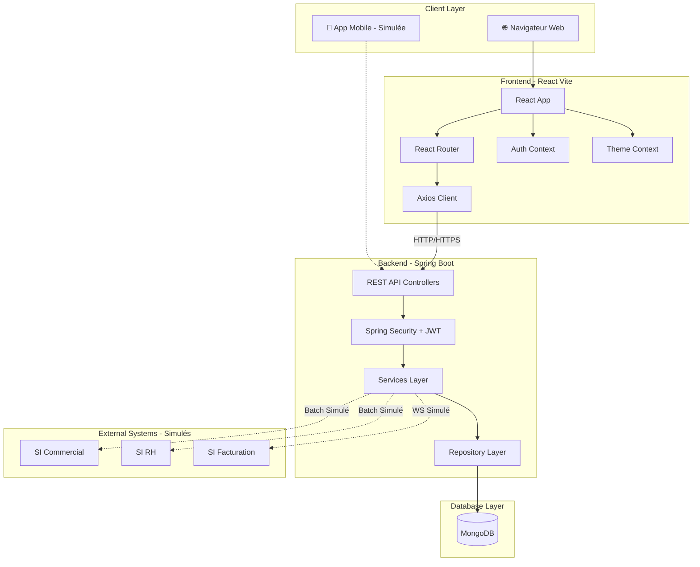
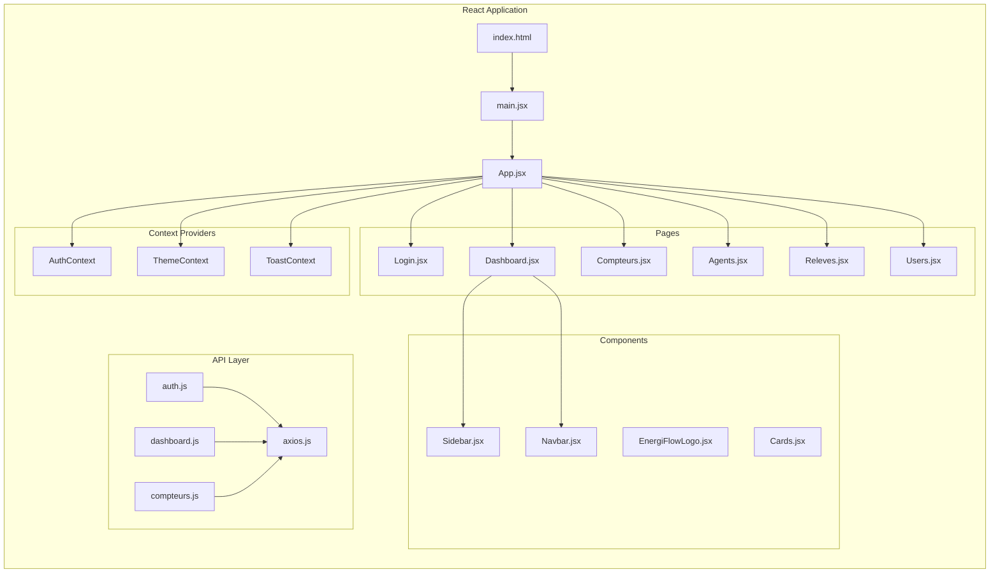
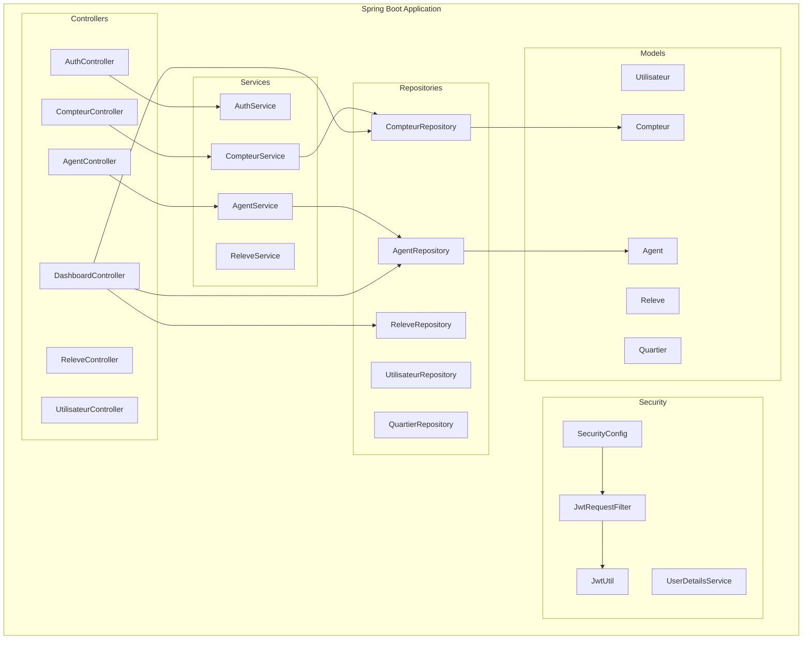
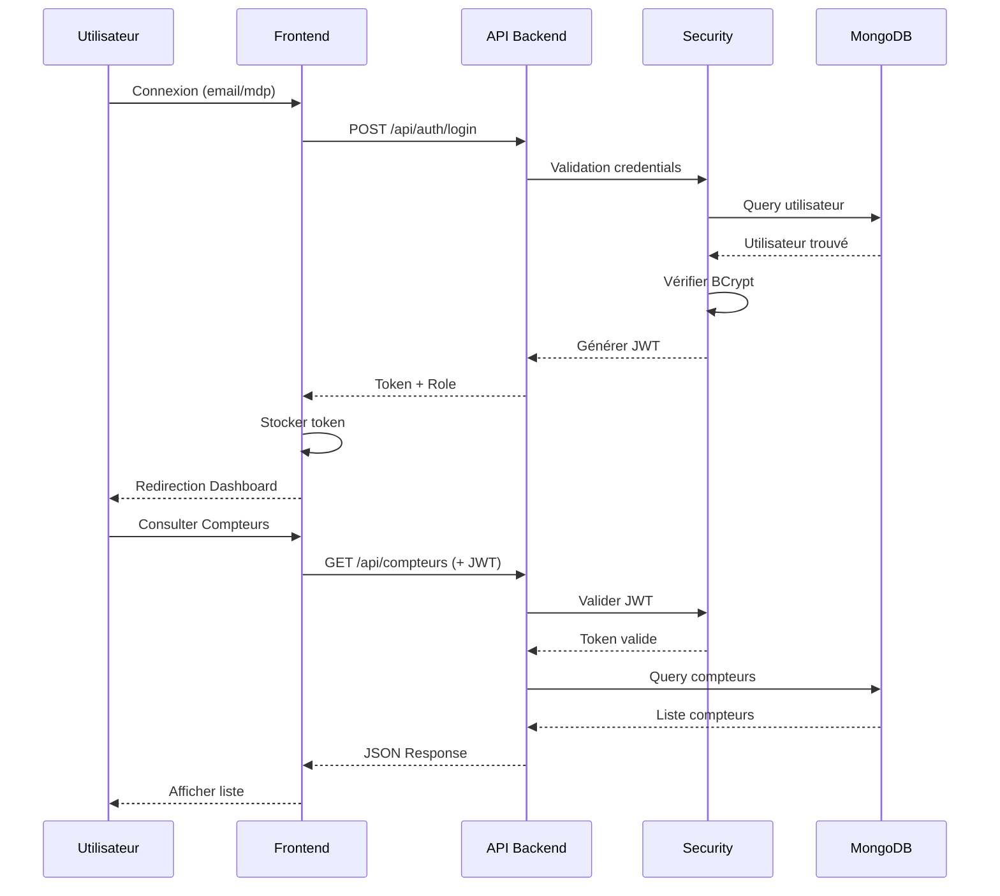
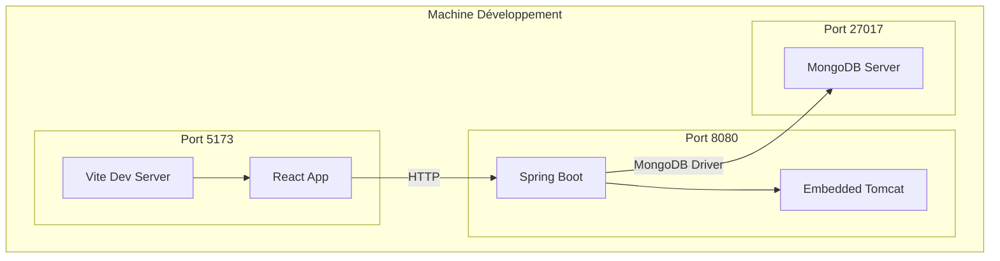
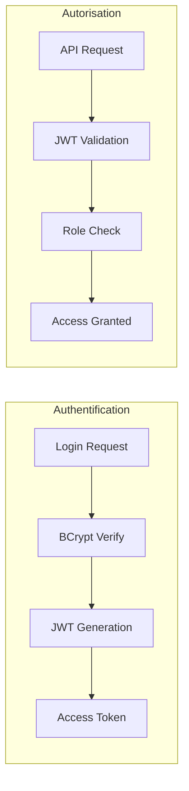

# Schéma d'Architecture
## SI Relevés - Composants Déployés

---

## 1. Vue d'Ensemble


```mermaid
graph TB
    subgraph "Client Layer"
        BROWSER[🌐 Navigateur Web]
        MOBILE[📱 App Mobile - Simulée]
    end
    
    subgraph "Frontend - React Vite"
        FE_APP[React App]
        FE_ROUTER[React Router]
        FE_AUTH[Auth Context]
        FE_THEME[Theme Context]
        FE_AXIOS[Axios Client]
    end
    
    subgraph "Backend - Spring Boot"
        BE_API[REST API Controllers]
        BE_SEC[Spring Security + JWT]
        BE_SVC[Services Layer]
        BE_REPO[Repository Layer]
    end
    
    subgraph "Database Layer"
        MONGODB[(MongoDB)]
    end
    
    subgraph "External Systems - Simulés"
        ERP_COM[SI Commercial]
        ERP_RH[SI RH]
        ERP_FACT[SI Facturation]
    end
    
    BROWSER --> FE_APP
    MOBILE -.-> BE_API
    
    FE_APP --> FE_ROUTER
    FE_APP --> FE_AUTH
    FE_APP --> FE_THEME
    FE_ROUTER --> FE_AXIOS
    FE_AXIOS -->|HTTP/HTTPS| BE_API
    
    BE_API --> BE_SEC
    BE_SEC --> BE_SVC
    BE_SVC --> BE_REPO
    BE_REPO --> MONGODB
    
    BE_SVC -.->|Batch Simulé| ERP_COM
    BE_SVC -.->|Batch Simulé| ERP_RH
    BE_SVC -.->|WS Simulé| ERP_FACT
```

---

## 2. Architecture Frontend


```mermaid
graph LR
    subgraph "React Application"
        INDEX[index.html]
        MAIN[main.jsx]
        APP[App.jsx]
        
        subgraph "Context Providers"
            AUTH[AuthContext]
            THEME[ThemeContext]
            TOAST[ToastContext]
        end
        
        subgraph "Pages"
            LOGIN[Login.jsx]
            DASH[Dashboard.jsx]
            COMP[Compteurs.jsx]
            AGENT[Agents.jsx]
            RELEV[Releves.jsx]
            USER[Users.jsx]
        end
        
        subgraph "Components"
            SIDEBAR[Sidebar.jsx]
            NAVBAR[Navbar.jsx]
            LOGO[EnergiFlowLogo.jsx]
            CARDS[Cards.jsx]
        end
        
        subgraph "API Layer"
            AXIOS[axios.js]
            API_AUTH[auth.js]
            API_DASH[dashboard.js]
            API_COMP[compteurs.js]
        end
    end
    
    INDEX --> MAIN --> APP
    APP --> AUTH & THEME & TOAST
    APP --> LOGIN & DASH & COMP & AGENT & RELEV & USER
    DASH --> SIDEBAR & NAVBAR
    API_AUTH --> AXIOS
    API_DASH --> AXIOS
    API_COMP --> AXIOS
```

---

## 3. Architecture Backend


```mermaid
graph TB
    subgraph "Spring Boot Application"
        subgraph "Controllers"
            AUTH_CTRL[AuthController]
            DASH_CTRL[DashboardController]
            COMP_CTRL[CompteurController]
            AGENT_CTRL[AgentController]
            RELEV_CTRL[ReleveController]
            USER_CTRL[UtilisateurController]
        end
        
        subgraph "Security"
            SEC_CONFIG[SecurityConfig]
            JWT_UTIL[JwtUtil]
            JWT_FILTER[JwtRequestFilter]
            USER_DETAILS[UserDetailsService]
        end
        
        subgraph "Services"
            AUTH_SVC[AuthService]
            COMP_SVC[CompteurService]
            AGENT_SVC[AgentService]
            RELEV_SVC[ReleveService]
        end
        
        subgraph "Repositories"
            USER_REPO[UtilisateurRepository]
            COMP_REPO[CompteurRepository]
            AGENT_REPO[AgentRepository]
            RELEV_REPO[ReleveRepository]
            QUART_REPO[QuartierRepository]
        end
        
        subgraph "Models"
            USER_MOD[Utilisateur]
            COMP_MOD[Compteur]
            AGENT_MOD[Agent]
            RELEV_MOD[Releve]
            QUART_MOD[Quartier]
        end
    end
    
    AUTH_CTRL --> AUTH_SVC
    DASH_CTRL --> COMP_REPO & AGENT_REPO & RELEV_REPO
    COMP_CTRL --> COMP_SVC --> COMP_REPO
    AGENT_CTRL --> AGENT_SVC --> AGENT_REPO
    
    COMP_REPO --> COMP_MOD
    AGENT_REPO --> AGENT_MOD
    
    JWT_FILTER --> JWT_UTIL
    SEC_CONFIG --> JWT_FILTER
```

---

## 4. Flux de Données


```mermaid
sequenceDiagram
    participant U as Utilisateur
    participant F as Frontend
    participant A as API Backend
    participant S as Security
    participant D as MongoDB
    
    U->>F: Connexion (email/mdp)
    F->>A: POST /api/auth/login
    A->>S: Validation credentials
    S->>D: Query utilisateur
    D-->>S: Utilisateur trouvé
    S->>S: Vérifier BCrypt
    S-->>A: Générer JWT
    A-->>F: Token + Role
    F->>F: Stocker token
    F-->>U: Redirection Dashboard
    
    U->>F: Consulter Compteurs
    F->>A: GET /api/compteurs (+ JWT)
    A->>S: Valider JWT
    S-->>A: Token valide
    A->>D: Query compteurs
    D-->>A: Liste compteurs
    A-->>F: JSON Response
    F-->>U: Afficher liste
```

---

## 5. Déploiement


```mermaid
graph TB
    subgraph "Machine Développement"
        subgraph "Port 5173"
            VITE[Vite Dev Server]
            REACT[React App]
        end
        
        subgraph "Port 8080"
            SPRING[Spring Boot]
            TOMCAT[Embedded Tomcat]
        end
        
        subgraph "Port 27017"
            MONGO[MongoDB Server]
        end
    end
    
    VITE --> REACT
    REACT -->|HTTP| SPRING
    SPRING --> TOMCAT
    SPRING -->|MongoDB Driver| MONGO
```

---

## 6. Sécurité


```mermaid
graph LR
    subgraph "Authentification"
        LOGIN[Login Request]
        BCRYPT[BCrypt Verify]
        JWT_GEN[JWT Generation]
        TOKEN[Access Token]
    end
    
    subgraph "Autorisation"
        REQUEST[API Request]
        JWT_VAL[JWT Validation]
        ROLE_CHECK[Role Check]
        ACCESS[Access Granted]
    end
    
    LOGIN --> BCRYPT --> JWT_GEN --> TOKEN
    REQUEST --> JWT_VAL --> ROLE_CHECK --> ACCESS
```

---

## 7. Ports et URLs

| Composant | Port | URL |
|-----------|:----:|-----|
| Frontend Dev | 5173 | http://localhost:5173 |
| Backend API | 8080 | http://localhost:8080/api |
| MongoDB | 27017 | mongodb://localhost:27017 |
| Swagger UI | 8080 | http://localhost:8080/swagger-ui.html |

---

## 8. Variables d'Environnement

### Backend (application.properties)
```properties
spring.data.mongodb.uri=mongodb://localhost:27017/sireleves
jwt.secret=votre-cle-secrete-256-bits
jwt.expiration=1800000
server.port=8080
```

### Frontend (.env)
```env
VITE_API_BASE_URL=http://localhost:8080/api
```

---

*Document généré avec assistance IA*
*Date : Décembre 2024*
